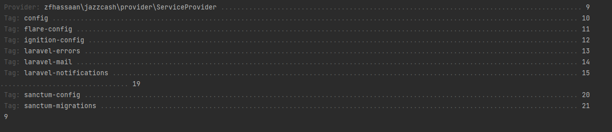

<!--suppress ALL -->
<p align="center">
  <br/>
  <!-- <h3 align="center">Payfast</h3> -->
</p>

[](https://packagist.org/packages/zfhassaan/jazzcash)
[](LICENSE.md)
[](https://packagist.org/packages/zfhassaan/jazzcash)


<h4> Disclaimer </h4>
This is unofficial Jazzcash API Payment Gateway. This repository  is only created to help developers in streamlining the integration process. You can Review the Official Payment Gateway <a href="https://sandbox.jazzcash.com.pk/Sandbox/" >here.</a> This Package only processes hosted checkout process. There's no Subscription option enabled yet.


#### About
JazzCash is a leading payment gateway in Pakistan that allows businesses to securely accept online payments from their customers. With fast and reliable transaction processing, advanced fraud protection, and a user-friendly interface, JazzCash makes it easy for merchants to grow their online sales. Whether you're a small business owner, e-commerce store owner, or a developer looking to integrate a payment gateway into your website or mobile app, JazzCash has a solution that fits your needs.
This document contains a detailed explanation of how to integrate with JazzCash's hosted checkout feature (version 1.0.0).

#### Intended Audience
This document is for merchants and developers who want to integrate with JazzCash to perform a hosted checkout.

#### Integration Scope
The merchant will implement all e-commerce functionality. The JazzCash service will only be used for payment processing with the hosted checkout feature.

#### API End Points
This package only contains the hosted checkout process. There are no API endpoints specified for direct checkout.

#### Integration Prerequisites
Merchants must be registered with JazzCash prior to integration. After signing up for a JazzCash account, the merchant will receive the following unique values to operate: `Merchant_ID`, `Password`, `Hashkey`, `Sandbox URL`, and `Production URL`. These keys are used to get a one-time authentication token, which

#### Installation
You can install the package via composer

````
composer require zfhassaan/jazzcash
````

#### Set .env configurations

```
JAZZCASH_PAYMENTMODE=sandbox
JAZZCASH_MERCHANTID=
JAZZCASH_PASSWORD=
JAZZCASH_HASHKEY=
JAZZCASH_MPIN=
JAZZCASH_PRODUCTION_URL=
JAZZCASH_SANDBOX_URL=
JAZZCASH_RETURNURL=
```

#### configuration
In your `config/app.php` file, add the following line to the providers array:

```php 
    /*
    * Package Service Providers...
    */

    \zfhassaan\jazzcash\provider\ServiceProvider::class,
```


In the `aliases` array of the same file, add the following line:

```php 
  'aliases' => Facade::defaultAliases()->merge([
        'Jazzcash' => \zfhassaan\jazzcash\facade\JazzcashFacade::class,
    ])->toArray(),
```
#### Publish Vendor:
Publish the package assets by running the following command:

```bash
php artisan vendor:publish 
```
This will show the following response in terminal:


press 9 to publish ```zfhassaan\jazzcash\provider\ServiceProvider``` provider

#### Steps:
##### Hosted Checkout
To initiate the hosted checkout process, send a POST request with the following parameters:

```json
{
    "amount":"1",
    "billref":"bill-reference",
    "productDescription": "Product Description"
}
```

Then, in your controller, use the following code:

```php
        $jazzcash = new JazzCash();
        $jazzcash->setAmount($request->amount);
        $jazzcash->setBillReference($request->billref);
        $jazzcash->setProductDescription($request->productDescription);
        return $jazzcash->sendRequest();
```
The index function is called and a new instance of the JazzCash class is created. The setAmount, setBillReference, and setProductDescription methods are called on the JazzCash object, passing in the amount, billref, and productDescription values from the request as arguments. These methods set the corresponding properties of the JazzCash object to the specified values.

The sendRequest method is called on the JazzCash object. This method sends a request to the JazzCash API to initiate the checkout process and returns the response from the API as an HTML template which can be rendered on the web and mobile application. To hide or show fields, you can use CSS to control the field's visibility on the frontend.

The response from the API is returned by the index function. This response can be used to display the hosted checkout form on your website or mobile app.

### Testing
To test the payment gateway, you can use the sandbox mode by setting `JAZZCASH_PAYMENTMODE=sandbox` in your `.env` file. This will allow you to test the checkout process without actually processing any payments.

To switch to production mode, set `JAZZCASH_PAYMENTMODE=production` in your `.env` file.

#### Changelog
Please see Changelog for more information what has changed recently.

#### Security
The following lines are taken from [briandk](https://gist.github.com/briandk/3d2e8b3ec8daf5a27a62) repository for contributing in an open source projects.

**Great Bug Reports** tend to have:

- A quick summary and/or background
- Steps to reproduce
    - Be specific!
    - Give sample code if you can. An issue includes sample code that *anyone* with a base R setup can run to reproduce what I was seeing
- What you expected would happen
- What actually happens
- Notes (possibly including why you think this might be happening, or stuff you tried that didn't work)


#### License
The MIT License (MIT). Please see [License File](LICENSE.md) for more information.
